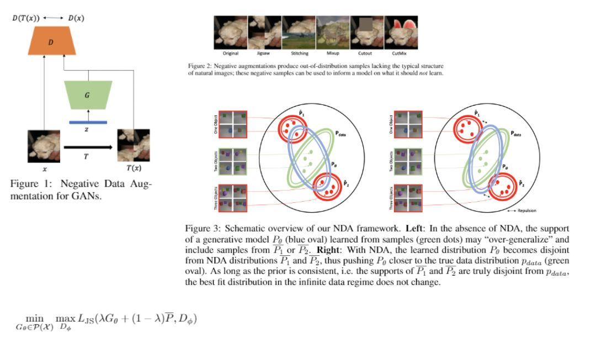

# Overview

Analysis of the Paper "Negative Data Augmentation" (ICLR 2021)

- Arxiv: [here](https://arxiv.org/abs/2102.05113)

# TLDR

Very interesting paper about generative models

A common failure mode for generative models, especially GAN, is they produce a significant amount of "false positives": samples that are not realistic.

Why?

Using an analogy with physics, standard GANs are trained by enforcing a sort of attractive potential between the generator distribution and the true distribution samples, using the discriminator.
Theoretical guarantees: generative distribution converges to the true distribution in the infinite data limit.

What happens in practice?

See Fig.3, in the finite data limit, if the green dots distribution is not representing the green oval properly then the blue oval won't be able to overlap well.

Simple solution: more and better green dots
But this is not always possible.

The idea proposed in this paper is simple yet powerful: adding to the attractive potential related to the positive samples, also a repulsive potential related to negative samples.

The repulsive potential has the same theoretical guarantees and makes the more system more samples efficient since generating negative samples from positive samples is simple and cheap: see Fig.2

-------

Also available on LinkedIn [here](https://www.linkedin.com/feed/update/urn:li:activity:6765609955648147456/)

# Details 

Understand more details about the paper 

- [Idea: Positive Data Augmentation](details/positive_data_augmentation.ipynb)

- [Idea: Negative Data Augmentation](details/negative_data_augmentation.ipynb)

